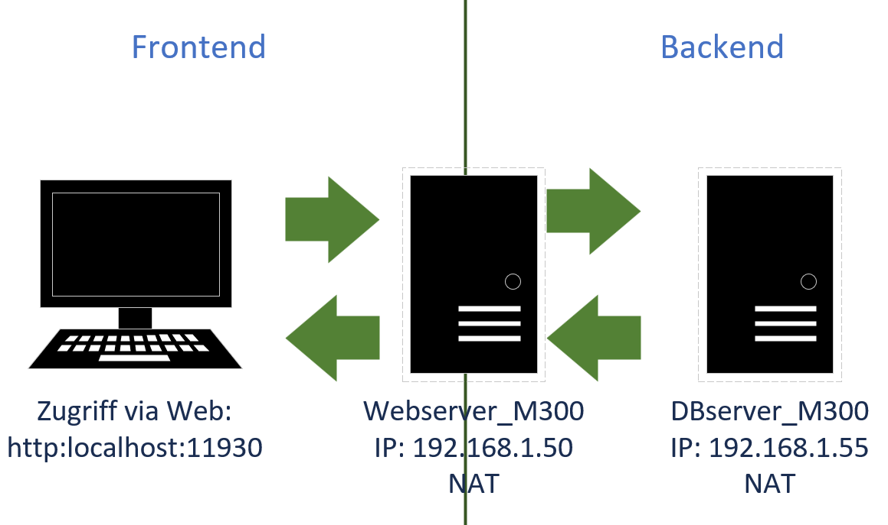
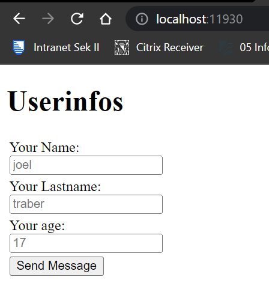
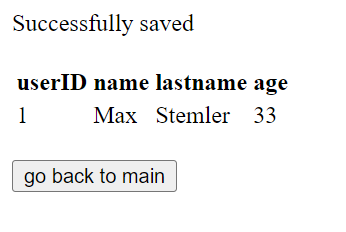
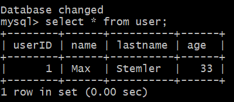

# Modul 300: Plattformübergreifende Dienste in ein Netzwerk integrieren
## Webbasierte Dateneingabe mit Datenbank im Hintergrund

### Projektbeschreibung
Der genaue Auftrag konnten die Teams selber bestimmen Als erstes haben wir die Teams gemacht und entschieden, was wir machen. Wir haben uns für einen Webserver mit einer Datenbankverknüpfung entschieden. Dafür arbeiten wir mit Vagrant, Virtualbox, HTML, PHP und Markdown.

### Inhaltsverzeichnis:
* [10 Umgebung](#10-umgebung)
* [20 Netzwerkplan](#20-netzwerkplan)
* [30 Codebeschreibung](#30-codebeschreibung)
* [40 Wichtige Befehle](#40-wichtige-befehle)
* [50 Hat es funktioniert?](#50-hat-es-funktioniert)
* [60 Fazit](#60-fazit)
* [70 Quellenverzeichnis](#70-quellenverzeichnis)

### 10 Umgebung
VirtualBox 6.1.32 Umgebung und Vagrant 2.2.19 mit einem Windows Host.

- **Webserver: Webserver_M300**
  - Ubuntu/Bionic64
  - Memory: 2048MB
  - Software: Apache2 webserver
  - IP & Port 192.168.1.50 guest: 80, host 11930

- **Datenbankserver: DBserver_M300**
  - Ubuntu/Bionic64
  - Memory: 2048MB
  - Software: MySQL DB
  - IP & Port 192.168.1.55:3306

### 20 Netzwerkplan
Als erstes, habe ich einen Netzwerkplan erstellt, damit ich alles richtig aufbaue. Hier drauf sieht man den Client, Webserver, Datenbank und die jeweilige IP-Adresse.



### 30 Codebeschreibung

##### Mit Vagrant VMs erstellen:
```
Vagrant.configure("2") do |config| 
```
Dieser Befehl muss am Anfang jedes Vagrant files stehen, dieser startet die "do" Schlaufe.
```
  #Webserver create 
  config.vm.define "web" do |web| 
```
Hier wird der eigentliche Server erstellt/definiert ("web" kann in unserem Fall auch durch "DB" ersetzt werden).
     
```
#vm config
web.vm.box = "ubuntu/bionic64"
web.vm.synced_folder "./sh_web", "/sh_f_web"
 ```
Hier sagt man, welche Software die VM haben sollten und welche Ordner synced werden sollten.
    
```
#Netconfig
web.vm.network "private_network", ip: "192.168.1.50",
virtualbox_intnet: true
web.vm.network "forwarded_port", guest: 80, host: 11930
```
Hier wird das Netzwerk der VM konfiguriert, wie IP und Ports + weitergeleitete Ports.

 ```
   #Vmspecs Web
    web.vm.provider "virtualbox" do |vm_web|
      vm_web.name = "Webserver_M300"
      vm_web.memory = "2048"
```

Hier kann man noch den Namen und die Arbeitsspeichergrösse definieren. 

```
end
```
Mit "end" ist das Erstellen dieser VM abgeschlossen.


##### Installationen auf dem <mark>**Webserver**</mark>:

  * ```apt-get update``` (Installiert die neuen Updates für das Ubunutu)
  * ``` apt-get install -y apache2``` (Installiert Apache. Apache ist ein Webserver)
  * ```apt-get install -y php libapache2-mod-php php-mysql``` (Installiert ein PHP-Modul, damit der Webserver kommunizieren kann)
  * ``` apt-get install -y mysql-client ``` (Installiert den MySQL Client)
  * ```rm -rf /var/www/html/index.html``` (Entfernt den Standard HTML-File)
  * ```cp /sh_f_web/index.html /var/www/html``` (Webformular wird dem Linux Ordner hinzugefügt)
  * ```cp /sh_f_web/userinfo.php /var/www/html``` (PHP-File wird dem Ordner hinzufügt)

##### SQL Installation:

```
sudo debconf-set-selections <<< "mysql-server mysql-server/root_password password Plokijuhz480"
sudo debconf-set-selections <<< "mysql-server mysql-server/root_password_again password Plokijuhz480"
```
Mit diesen Befehlen, setzt man das Root-Password.

> **NOTE:** Das Passwort ist: Plokijuhz480

```
sudo apt-get update
sudo apt-get install -y mysql-server
```
Hier updated und installiert den MySQL Server.
```
sudo sed -i -e"s/^bind-address\s=\s127.0.0.1/bind-address = 0.0.0.0/" /etc/mysql/mysql.conf.d/mysqld.cnf
```
Hier öffnet man den Port für MySQL und das Konfigurationsfile im Ubuntu.

```
mysql -uroot -pPlokijuhz480 <<%EOF%
    CREATE USER "trj"@"192.168.1.50" IDENTIFIED BY "Qawsedrft123";
    GRANT ALL PRIVILEGES ON . TO "trj"@"192.168.1.50";
    FLUSH PRIVILEGES;
```
Hier erlaubt man der IP: "192.168.1.50" Remote Access mit dem Benutzernamen "TRJ" und Passwort "Qawsedrft123".

```
    CREATE DATABASE UserDB;
    USE UserDB;
    CREATE TABLE user(userID int auto_increment, name varchar(30), lastname varchar(30), age int, primary key(userID));

%EOF%
```
Hier erstellt man die Datenbank "UserDB" und erstellt die Tabellen mit den Inhalten: "name", "lastname" und "age".

```
sudo service mysql restart
```
Hier restartet man den Server noch, da man Konfigurationsänderungen gemacht hat.

##### HTML:
```
<div class="form">
    <form method="POST" action="userinfo.php">
        <h1>Userinfos</h1>
```
Hier wird die Formular-Methode bestummen und auf welches PHP es referenbzieren soll, in diesem Fall "userinfo.php".
```
  <table>
  <tr>
      <td>
          <label for="name">Your Name:</label><br>
          <input type="text" name="name" placeholder="joel" id="">
      </td>
  </tr>
  <tr>
      <td>
          <label for="lastname">Your Lastname:</label><br>
          <input type="text" name="lastname" placeholder="traber" id="">
      </td>
  </tr>
  <tr>
      <td>
          <label for="age">Your age:</label><br>
          <input type="number" name="age" placeholder="17" id="">
      </td>
  </tr>
```
Hier wird die Tabelle erstellt und mit den Platzhaltern (steht leicht ausgegegraut) in den Formular-Feldern.
```
                <td>
                    <input type="submit" name="submit" value="Send Message">
                </td>
```
Mit "Input type" und "name", "value" wird der absende Knopf erstellt. Damit ist der Inhalt des index.html auch schon fertig

##### PHP:
```
<?php
if(isset($_POST['submit']))
    {
        # save data from form in variables
        $name = $_POST['name'];
        $lastname = $_POST['lastname'];
        $age = $_POST['age'];
        
        # Database Infos
        $host = "192.168.1.55";
        $username = "trj";
        $password = "Qawsedrft123";
        $dbname = "UserDB";

        # variable for the connection
        $con = mysqli_connect($host, $username, $password, $dbname);
```
 Mit diesem Befehlsblock gibt man die Datenbankinfos an und verbindet sich damit mit der Datenbank.
```      
if (!$con)
{
    die("Connection failed!" . mysqli_connect_error());
}
```
Falls die Verbinfung zur Datenbank fehlschlägt, gibt es eine Fehlermeldung.
```
# variable for insert into table
$sql = "INSERT INTO user (userID, name, lastname, age) VALUES ('0', '$name', '$lastname', '$age')";

# put everything together into the mysql query
$rs = mysqli_query($con, $sql);
if($rs)
{
    echo "Successfully saved";
}
```
Mit diesen Befehlen werden die Eingaben in die Datenbank geschrieben. Wenn alles reingeschrieben wurden gibt es eine Erfolgsmeldung.
```
# SELECT statement in query variable
$sqlsel = "SELECT userID, name, lastname, age from user";
$result = $con-> query($sqlsel);
```
Dieser Befehl holt die Variabeln aus der Tabelle.
```
if ($result-> num_rows > 0) {
    while ($row = $result-> fetch_assoc()) {
        echo "<br/><br><tr><td>". $row["userID"] ."</td><td>". $row["name"] ."</td><td>". $row["lastname"] ."</td><td>". $row["age"] ."</td></tr>";
    }
    echo "</table>";
}
else {
    echo "nothing in table";
}
```
Dieser Code erstellt die Tabelle auf der Website, auf die man weitergeleitet wird, nachdem man seine Daten eingegeben hat. Und zeigt den ganzen Inhalt der Tabelle an.
```
mysqli_close($con);
```
Mit diesem Befehl, schliesst man die MySQL connection


### 40 Wichtige Befehle
#### Befehlstabelle Vagrant:
|Resultat    |Command                   |
|-------------------------|--------------------------|
|hochfahren / erstellen   |`vagrant up`              |
|herunterfahren           |`vagrant halt`            |
|löschen                  |`vagrant destroy`         |
|SSH Verbindung auf DB-Server   |`vagrant ssh DB`              |
|SSH Verbindung auf Web-Server           |`vagrant ssh web`            |
|SSH Verbindung trennen          |`exit`            |


#### Befehlstabelle SQL:
|Resultat  |Command                   |
|-------------------------|--------------------------|
|hochfahren / erstellen   |`mysql -uroot -p` und dann das Passwort             |
|Datebank auswählen          |`use UserDB;`            |
|Gibt Daten der Tabelle aus                |`select * from user;`         |


### 50 Hat es funktioniert
Ja, alles hat funktioniert wie man an den folgenden Screenshots sehen kann:


</br>
Das ist die Dateneingabe-Maske auf der Website.


</br>
Die Dateneingabe auf der Website war erfolgreich.


</br>
Hier sieht man, dass die Daten erfolgreich in der Datenbank gespeichert wurden.

#### Selber überprüfen:
* Mit "Git Bash" in das richtige Verzeichnis wechseln (lb2-Ordner).
* Command `vagrant up` ausführen (Somit werden die Virtuellen Maschinen erstellt)
* Warten bis es fertig ist
* Website: http://localhost:8080, Dort ist ein Formular mit: "Name, Lastname und Age". Falls es funktioniert sollte auf der Seite, auf die man weitergeleitet wird "Successfully saved" stehen
* Wenn man noch in die Daten bank will, kann man den Befehlen aus [40 Wichtige Befehle](#40-wichtige-befehle) in die Datenbank schauen. (Passwort: Plokijuhz480)

### 60 Fazit
Es war ein sehr spannendes Modul, denn ich hatte absolut keine Erfahrung mit Vagrant. Deshalb war ich sehr glücklich in einer solch guten Gruppe gewesen zu sein, die mir helfen konnte. Am Schluss hat alles perfekt so funktioniert, wie wir es geplant haben. Das einzige, was ich eventuell hätte verbessern können wäre die Gestaltung der Website, da jedoch laut dem Lehrer nur die Funktionalität zählt, habe ich das Websiten-Design vernachlässigt.

### 70 Quellenverzeichnis
* [Github von Herr Berger](https://github.com/mbe99/M300)
* [Vagrant Basics/Cheatsheet](https://github.com/mc-b/M300/tree/master/10-Toolumgebung)
* [SQL Server Basics](https://www.sqlservertutorial.net/sql-server-basics/)
* [HTML-Formular mit Datenbank verbinden](https://www.webcodzing.com/connect-html-form-to-mysql-database-using-php/)
* [HTML-Formular erstellen](https://praxistipps.chip.de/html-formulare-erstellen-so-funktionierts_39325)
